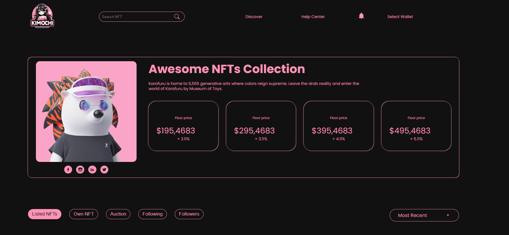

# HOME

# OWNER NFT

# CREATE NFT

# Install with `npm`.
```sh
npm i 
```

## Building locally

In your project directory, run `npm run dev`. You can now visit http://localhost:3000 to see your app and login!


